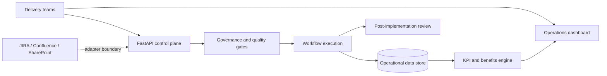

# AI Delivery Enablement Control Plane

[](https://github.com/krishnabyf/ai-delivery-enablement-control-plane/actions/workflows/ci.yml)
[](https://github.com/krishnabyf/ai-delivery-enablement-control-plane/actions/workflows/codeql.yml)

A production-shaped platform for governing automation workflows, measuring operational
performance, and scaling successful pilots into repeatable AI delivery services.

This project demonstrates the full enablement loop: prioritise automation opportunities,
standardise workflow execution, enforce quality controls, quantify cost and capacity benefits,
monitor delivery health, and capture post-implementation learning.

## Why this project

AI delivery organisations often automate individual scripts without a consistent operating
model. That creates fragmented reporting, unclear ownership, hard-to-audit changes, and weak
benefits tracking. The control plane provides one contract for workflow governance and one
portfolio view of reliability, quality, adoption, cost, and capacity.

## Capabilities

- Versioned workflow definitions spanning setup, pre-processing, execution, quality gates,
  post-processing, and reporting.
- API-key protected workflow creation, execution, and post-implementation reviews.
- Central dashboard for automation rate, SLA attainment, quality, adoption, hours saved,
  records processed, and estimated cost savings.
- Correlation IDs and immutable run history for operational support and auditability.
- SQLite for zero-friction evaluation with a configurable database URL for PostgreSQL.
- Non-root container, health checks, persistent storage, CI, test coverage, linting, and CodeQL.
- Practical 90-day automation roadmap, lean support model, governance gates, and runbook.

## Architecture



## Quick start in Ubuntu

```bash
git clone https://github.com/krishnabyf/ai-delivery-enablement-control-plane.git
cd ai-delivery-enablement-control-plane
python3 -m venv .venv
.venv/bin/pip install -e ".[dev]"
.venv/bin/uvicorn app.main:app --reload
```

Open:

- Dashboard: <http://localhost:8000>
- OpenAPI documentation: <http://localhost:8000/docs>
- Health: <http://localhost:8000/health>

The application seeds representative workflow and KPI data on first startup.

## Run with Docker

Use the published, versioned image:

```bash
docker pull ghcr.io/krishnabyf/ai-delivery-enablement-control-plane:1.0.0
docker run --name delivery-control-plane \
  -p 8000:8000 \
  -e CONTROL_PLANE_API_KEY=replace-with-a-long-random-secret \
  -v control-plane-data:/app/data \
  ghcr.io/krishnabyf/ai-delivery-enablement-control-plane:1.0.0
```

Or build locally with Docker Compose:

```bash
cp .env.example .env
# Set a strong CONTROL_PLANE_API_KEY in .env.
docker compose up --build -d
curl --fail http://localhost:8000/health
```

Published image tags:

- `1.0.0`: immutable release version
- `1.0`: latest compatible 1.0 patch release
- `latest`: most recent stable release

## API example

```bash
curl -X POST http://localhost:8000/api/v1/workflows/1/runs \
  -H "Content-Type: application/json" \
  -H "X-API-Key: local-development-key" \
  -d '{"triggered_by":"operations.lead","input_records":5000,"quality_score":0.99}'
```

## Quality checks

```bash
make install
make check
docker build -t delivery-enablement-control-plane:local .
```

## Production decisions

| Concern | Current implementation | Scale path |
|---|---|---|
| Persistence | SQLite volume | Managed PostgreSQL with PITR |
| Authentication | API key | OIDC/SSO with role-based access |
| Execution | Synchronous reference runner | Queue-backed workers and idempotency |
| Integrations | Stable API boundary | JIRA, Confluence, SharePoint adapters |
| Reporting | Live operational KPIs | Warehouse export and BI semantic model |
| Deployment | Docker Compose | Kubernetes/ECS with managed secrets |

## Documentation

- [Automation roadmap](docs/AUTOMATION_ROADMAP.md)
- [Enablement operating model](docs/OPERATING_MODEL.md)
- [Production runbook](docs/RUNBOOK.md)
- [Architecture decisions](docs/ARCHITECTURE.md)

## Interview narrative

This repository supports a concise leadership story:

1. Baseline fragmented operational work with quality, time, cost, and risk metrics.
2. Pilot high-value workflows behind common governance and measurement controls.
3. Prove benefits through run-level telemetry and operator adoption.
4. Scale through reusable templates, service levels, CI, documentation, and champions.
5. Optimise the portfolio through delivery-health reviews and benefits audits.

## License

MIT
